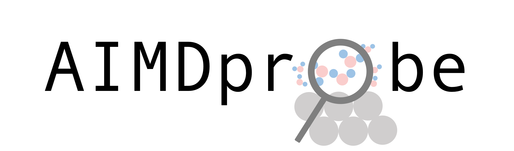

A simple toolkit to analyze ab initio molecular dynamics (AIMD) simulation results

## Installation

git clone git@github.com:tjunewson/AIMDprobe.git
pip install AIMDprobe

## Dependency
AIMDprobe uses several Python packages:
- numpy
- matplotlib
- ASE (Atomic Simulation Environment)
- json

## Usage

## How to contribute

AIMDprobe is a toolkit we develop in Cattheory Group here at DTU Lyngby, to help analyze AIMD simulation results and shed light on the interfacial chemistry / catalysis. 

We write our probe functions in 100% Python scripts and some of the probes are still in development. We welcome all kinds of feedbacks and suggestions on our AIMDprobe toolkit, especially if you would like to add any new functions (we have an 'other probes' branch for you)!

## Contributors

Sihang Liu, Sudarshan Vijay, Mianle Xu and more

